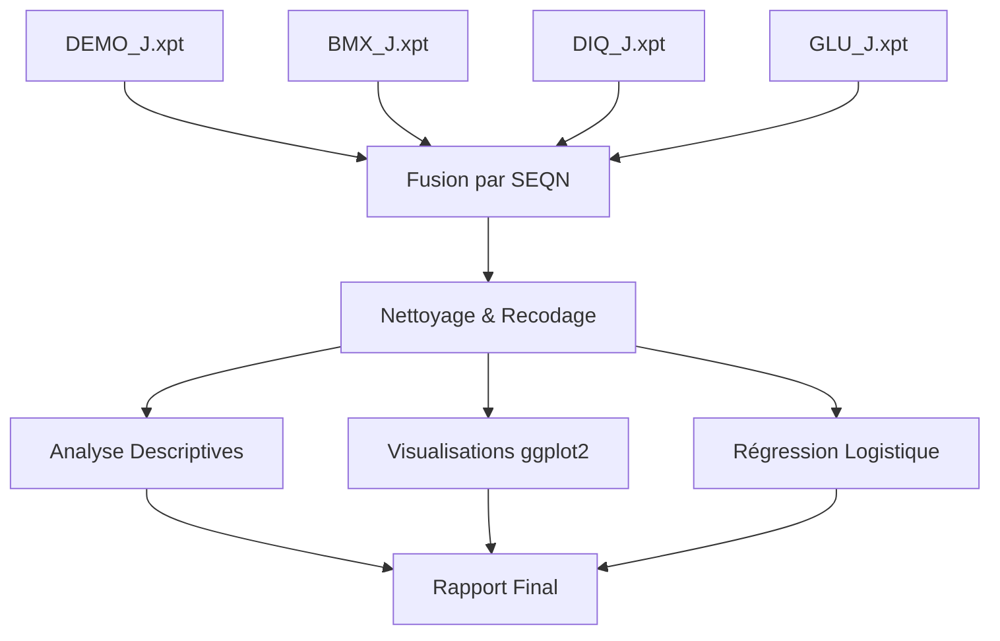

# Analyse des données NHANES (Étude Diabète, Âge, IMC)

[](https://www.r-project.org/)
[](https://quarto.org/)
[]()

Ce projet analyse les données du **National Health and Nutrition Examination Survey (NHANES)**, cycle 2017-2018 (J), pour explorer les liens entre l'âge, l'Indice de Masse Corporelle (IMC) et la prévalence du diabète.

## 📋 Aperçu du projet

L'objectif principal est d'évaluer comment les facteurs physiologiques (IMC) et démographiques (Âge) influent sur le risque de diabète déclaré dans la population américaine.

### Points clés de l'analyse :
- **Fusion de données** : Intégration des modules Démographie, Anthropométrie, Questionnaire Diabète et Glycémie.
- **Distribution** : Analyse de la répartition de l'IMC et de l'âge.
- **Modélisation** : Régression logistique pour quantifier l'impact de chaque facteur via les **Odds Ratios**.

---

## 🛠️ Méthodologie et Flux de données

Le projet suit un pipeline de données rigoureux, de l'extraction des fichiers `.xpt` à la génération du rapport final.

### Pipeline de traitement


### Variables d'intérêt
| Variable | Libellé Original | Description |
| :--- | :--- | :--- |
| `SEQN` | Respondent sequence number | Identifiant unique de l'individu |
| `age` | RIDAGEYR | Âge en années |
| `sex` | RIAGENDR | Genre (Masculin/Féminin) |
| `bmi` | BMXBMI | Indice de Masse Corporelle (kg/m²) |
| `diabetes_bin` | DIQ010 | Statut binaire (Diabétique=1, Sain=0) |
| `glucose` | LBXGLU | Glycémie à jeun (mg/dL) |

---

## 📂 Structure du projet

- `Data/` : Contient les fichiers de données brutes au format `.xpt`.
- `analyse_nhanes.qmd` : Le fichier source Quarto (Code R + Markdown).
- `analyse_nhanes.html` : Le rapport final interactif.
- `custom.css` : Styles CSS pour personnaliser le rapport.
- `Projet_R.ipynb` : Notebook pour des explorations complémentaires.

## � Installation et Utilisation

### Prérequis
- **R** (version 4.0+) & **Quarto**
- Packages nécessaires :
  ```r
  install.packages(c("haven", "dplyr", "ggplot2", "knitr", "forcats"))
  ```

### Exécution
1. Clonez ce répertoire.
2. Ouvrez `analyse_nhanes.qmd` dans RStudio.
3. Cliquez sur **Render** pour générer le rapport HTML.

L'analyse transversale des données NHANES révèle des associations métaboliques robustes via le modèle de régression logistique :
- **Impact de l'IMC** : Chaque unité d'IMC supplémentaire augmente le risque de diabète de **7,4%** (**OR = 1.07**), confirmant le rôle de l'adiposité excessive.
- **Effet du Vieillissement** : Le risque croît de **6,4% par an** (**OR = 1.06**), reflétant l'usure physiologique pancréatique.
- **Disparité de Genre** : À âge et IMC égaux, les hommes ont un risque **49% plus élevé** (**OR = 1.49**) que les femmes.

---
**Auteur** : Lina BOUALLEGUE
**Données** : NHANES 2017-2018 (Cycle J)
**Contact** : [https://github.com/linabouallegue]
