# Analyse des données NHANES (Étude Diabète, Âge, IMC)

[](https://www.r-project.org/)
[](https://quarto.org/)
[]()

Ce projet analyse les données du **National Health and Nutrition Examination Survey (NHANES)**, cycle 2017-2018 (J), pour explorer les liens entre l'âge, l'Indice de Masse Corporelle (IMC) et la prévalence du diabète.

## 📋 Aperçu du projet

L'objectif principal est d'évaluer comment les facteurs physiologiques (IMC) et démographiques (Âge) influent sur le risque de diabète déclaré dans la population américaine.

### Points clés de l'analyse :
- **Fusion de données** : Intégration des modules Démographie, Anthropométrie, Questionnaire Diabète et Glycémie.
- **Distribution** : Analyse de la répartition de l'IMC et de l'âge.
- **Corrélations** : Visualisation de la progression du diabète en fonction de l'âge et de la surcharge pondérale.

---

## 🛠️ Méthodologie et Flux de données

Le projet suit un pipeline de données rigoureux, de l'extraction des fichiers `.xpt` à la génération du rapport final.

### Pipeline de traitement

```mermaid
graph TD
    A[DEMO_J.xpt - Démographie] --> E[Fusion par SEQN]
    B[BMX_J.xpt - Anthropométrie] --> E
    C[DIQ_J.xpt - Questionnaire Diabète] --> E
    D[GLU_J.xpt - Glycémie] --> E
    E --> F[Nettoyage & Recodage]
    F --> G[Analyse Descriptives]
    F --> H[Visualisations ggplot2]
    G --> I[Rapport Quarto .html]
    H --> I
```


### Variables d'intérêt
| Variable | Libellé Original | Description |
| :--- | :--- | :--- |
| `SEQN` | Respondent sequence number | Identifiant unique de l'individu |
| `age` | RIDAGEYR | Âge en années au moment de l'examen |
| `sex` | RIAGENDR | Genre (Recodé en Masculin/Féminin) |
| `bmi` | BMXBMI | Indice de Masse Corporelle (kg/m²) |
| `diabetes` | DIQ010 | Statut du diabète (Diabétique/Non-diabétique) |
| `glucose` | LBXGLU | Glycémie à jeun (mg/dL) |

---

## 📂 Structure du projet

- `Data/` : Contient les fichiers de données brutes au format `.xpt`.
- `analyse_nhanes.qmd` : Le fichier source Quarto (Code R + Markdown).
- `analyse_nhanes.html` : Le rapport final interactif.
- `custom.css` : Styles CSS pour personnaliser le rapport.
- `Projet_R.ipynb` : Notebook pour des explorations complémentaires.

## � Installation et Utilisation

### Prérequis
- **R** (version 4.0+) & **Quarto**
- Packages nécessaires :
  ```r
  install.packages(c("haven", "dplyr", "ggplot2", "knitr", "forcats"))
  ```

### Exécution
1. Clonez ce répertoire.
2. Ouvrez `analyse_nhanes.qmd` dans RStudio.
3. Cliquez sur **Render** pour générer le rapport HTML.

## 📊 Synthèse des Résultats

L'analyse transversale des données NHANES révèle des associations métaboliques robustes :
- **Lien Pathophysiologique (IMC)** : Chaque unité d'IMC supplémentaire est associée à une augmentation de **7% des odds** de diabète, confirmant le rôle de l'obésité dans l'étiologie de l'insulinorisistance.
- **Progression Épidémiologique (Âge)** : Le risque croît de **6% par an**, traduisant une vulnérabilité accrue liée au vieillissement des cellules pancréatiques.
- **Disparités de Genre** : Après ajustement, les hommes présentent une probabilité plus élevée (**OR ≈ 1.48**) que les femmes dans cet échantillon.

---
**Auteur** : Lina BOUALLEGUE
**Données** : NHANES 2017-2018 (Cycle J)
**Contact** : [https://github.com/linabouallegue]
